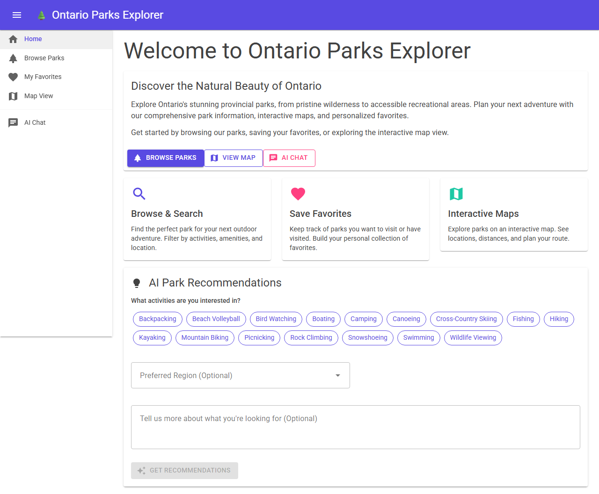
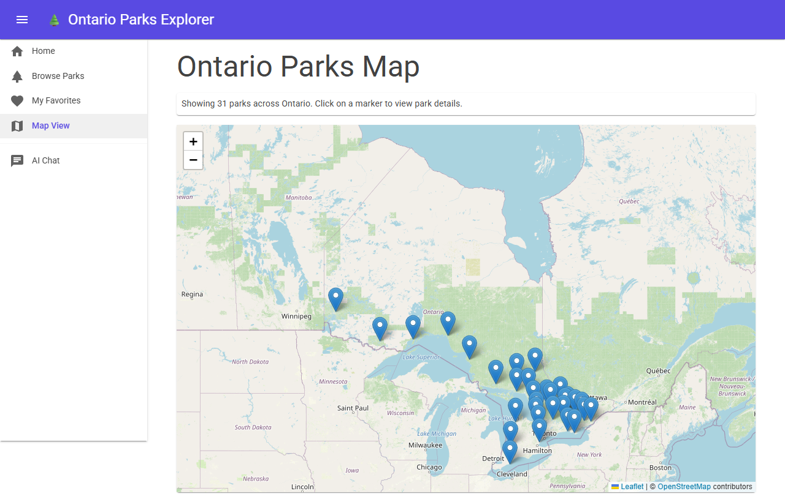
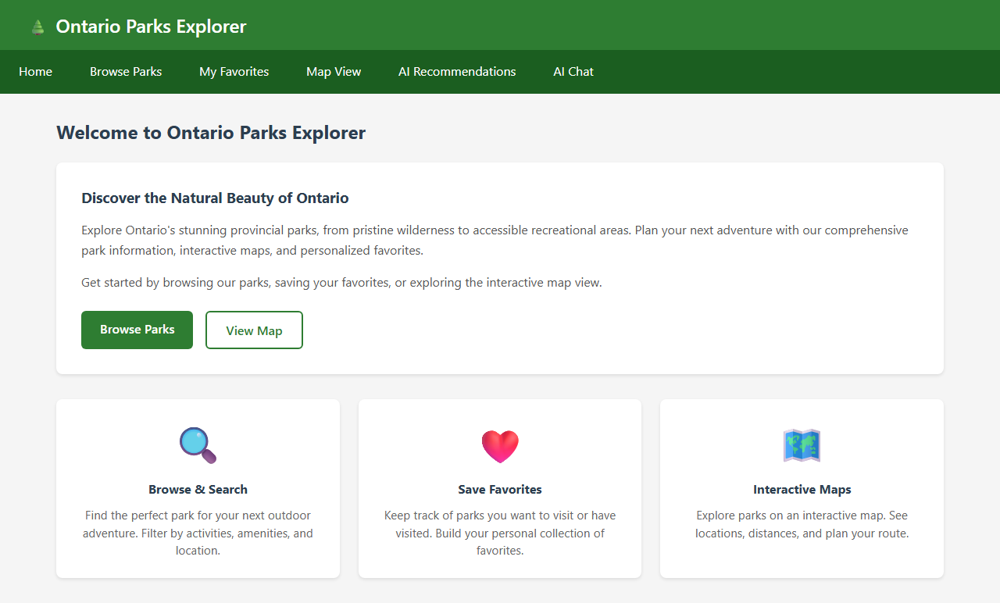
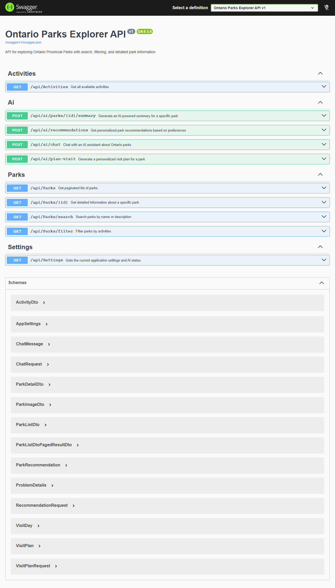

# 🏕️ Ontario Parks Explorer

> **A sample end-to-end application built entirely with [GitHub Copilot CLI](https://github.com/github/copilot-cli) and [Squad](https://github.com/bradygaster/squad)** — demonstrating how AI-powered development tools can create a production-quality, full-stack .NET Aspire application from a natural language prompt.

     


---

## 🤖 Built with AI — The Original Prompt

This entire application was created and maintained using **GitHub Copilot CLI** with the **Squad** agent orchestration framework. Here's the PRD that started it all ([full prompt](docs/ontario_parks_explorer_prompt.md)):

> *"Build an Ontario Parks Explorer app using .NET 10, Aspire, Blazor, React, and GitHub Copilot SDK. Create a modern full-stack application that allows users to explore parks in Ontario, view details about each park, and interact with the data in a visual and intuitive way."*

The meta-instruction: **"Create a team and a plan to complete this. Do not implement anything."** — planning before coding.

From that PRD, the Squad team:
- Built a complete **full-stack .NET Aspire application** with dual frontends (Blazor + React)
- Seeded **67 Ontario Provincial Parks** with activities, coordinates, and images
- Integrated **GitHub Copilot SDK** for AI-powered park summaries, chat, and visit planning
- Created **46+ unit tests** and **Playwright E2E specs** with automated screenshot capture
- Produced a **User Manual**, **Demo Script**, and **Journey narrative**

> 📖 Read the full story in [**JOURNEY.md**](docs/JOURNEY.md) — including how the AI team drifted from spec and the human caught it.

---

## 🦖 Meet the Squad Team

This repository is maintained by a Squad team cast from the **Jurassic Park** universe. Each agent has specialized expertise and persistent memory of the project:

| Agent | Role | What They Do |
|-------|------|-------------|
| 🏗️ **Malcolm** | Lead / Architect | Architecture decisions, code review, scope arbitration |
| 🔧 **Arnold** | Backend Dev | ASP.NET Core APIs, EF Core, database, services |
| ⚛️ **Sattler** | Frontend Dev | Blazor UI, React frontend, map integration, UX |
| 🤖 **Grant** | AI Dev | Copilot SDK integration, prompt engineering, agent design |
| 🧪 **Muldoon** | Tester | Unit tests, E2E tests, quality gates, edge cases |
| ⚙️ **Hammond** | Aspire Expert | .NET Aspire orchestration, service discovery, dashboards |
| 📋 **Scribe** | Session Logger | Decisions, memory, cross-agent context sharing |
| 🔄 **Ralph** | Work Monitor | Work queue, backlog tracking, CI/CD monitoring |

> The Squad framework assigns persistent character names as easter eggs — they don't affect behavior, just make the team memorable. 🦕

---

## Overview

Ontario Parks Explorer is a full-stack application for discovering, exploring, and planning visits to Ontario Provincial Parks. It combines traditional park discovery features with AI-powered features — all orchestrated with .NET Aspire.

### ✨ Features

| Feature | Description |
|---------|-------------|
| 🔍 **Park Discovery** | Browse, search, and filter 67+ Ontario Provincial Parks |
| 🗺️ **Interactive Maps** | Leaflet-powered map with park markers and location data |
| 🤖 **AI Chat** | Ask questions about parks using GitHub Copilot SDK |
| 📋 **Visit Planner** | AI-generated day-by-day itineraries |
| ⭐ **Favorites** | Save parks for quick access (client-side) |
| 💡 **Recommendations** | Personalized park suggestions based on your preferences |
| ⚙️ **Settings** | View AI and map configuration status |
| 📊 **Aspire Dashboard** | Real-time service health, logs, and metrics |

### Blazor Frontend






### React Frontend



---

## Architecture

```
┌─────────────────────────────────────────────────────────────────────────┐
│                      ONTARIO PARKS EXPLORER                              │
├─────────────────────────────────────────────────────────────────────────┤
│                                                                           │
│  ┌──────────────────────┐         ┌──────────────────────┐               │
│  │   Blazor UI          │         │   React UI           │               │
│  │  (MudBlazor)         │         │  (TypeScript/Vite)   │               │
│  │                      │         │                      │               │
│  │ • Park List          │         │ • Park Grid          │               │
│  │ • Search & Filter    │         │ • Map Integration    │               │
│  │ • Favorites          │         │ • Chat Interface     │               │
│  │ • AI Features        │         │ • Recommendations    │               │
│  └──────────┬───────────┘         └──────────┬───────────┘               │
│             │                                │                           │
│             └────────────────┬───────────────┘                           │
│                              │                                           │
│                    ┌─────────▼──────────┐                               │
│                    │  ASP.NET Core API  │                               │
│                    │  (REST Endpoints)  │                               │
│                    │                    │                               │
│                    │ • Parks Endpoints  │                               │
│                    │ • Activities List  │                               │
│                    │ • AI Services      │                               │
│                    └─────────┬──────────┘                               │
│                              │                                           │
│              ┌───────────────┼───────────────┐                          │
│              │               │               │                          │
│       ┌──────▼────────┐  ┌───▼────────┐ ┌──▼────────────┐              │
│       │    SQLite     │  │  GitHub   │ │ Health Checks │              │
│       │   Database    │  │  Copilot  │ │ & Metrics    │              │
│       │  (EF Core)    │  │  SDK      │ │              │              │
│       └───────────────┘  └────────────┘ └──────────────┘              │
│                                                                         │
│                    .NET Aspire Orchestration                           │
│                    (Service Discovery & Health)                        │
│                                                                         │
└─────────────────────────────────────────────────────────────────────────┘
```

### Tech Stack

| Layer | Technology |
|-------|-----------|
| **Backend** | .NET 10, ASP.NET Core, Entity Framework Core, SQLite |
| **Blazor Frontend** | Blazor Server, MudBlazor components, Leaflet maps |
| **React Frontend** | React 19, TypeScript, Vite, React Router |
| **AI** | GitHub Copilot SDK, Microsoft Agent Framework |
| **Orchestration** | .NET Aspire (service discovery, health checks, dashboard) |
| **Testing** | xUnit, Playwright (E2E), 46+ unit tests |

---

## Getting Started

### Prerequisites

- [.NET 10 SDK](https://dotnet.microsoft.com/download)
- [Node.js 18+](https://nodejs.org/)
- [Aspire CLI](https://aspire.dev/install) — `irm https://aspire.dev/install.ps1 | iex`

### 1. Clone and Install

```bash
git clone https://github.com/elbruno/CanadaParksTour.git
cd CanadaParksTour/OntarioParksExplorer

# Install React dependencies
cd OntarioParksExplorer.React && npm install && cd ..
```

### 2. Run with Aspire

```bash
aspire run
```

This starts all services and shows the **Aspire Dashboard URL with login token**:

```
   Dashboard:  https://localhost:17139/login?t=<your-token-here>
```

Click the dashboard URL to see all running services:


### 3. Access the Application

| Service | URL | Description |
|---------|-----|-------------|
| **Aspire Dashboard** | Shown in terminal output | Service health, logs, metrics |
| **Blazor Frontend** | https://localhost:7113 | Interactive server-rendered UI |
| **React Frontend** | http://localhost:5173 | Modern SPA |
| **API + Swagger** | https://localhost:7054/swagger | REST API documentation |

> **Note:** Ports are dynamically assigned by Aspire. Check the dashboard for actual URLs.

### 4. Enable AI Features (Optional)

AI features use **GitHub Copilot SDK** — no API keys needed, just your existing Copilot installation:

```bash
# Install and authenticate Copilot CLI
gh extension install github/gh-copilot
copilot auth login
```

If the Copilot CLI is not available, AI endpoints gracefully degrade with informational messages.

---

## API Endpoints

### Parks

| Method | Endpoint | Description |
|--------|----------|-------------|
| `GET` | `/api/parks` | List parks (paginated, 12/page) |
| `GET` | `/api/parks/{id}` | Park details |
| `GET` | `/api/parks/search?q=query` | Search by name/description |
| `GET` | `/api/parks/filter?activities=hiking&mode=any` | Filter by activities |
| `GET` | `/api/activities` | List all activities |

### AI

| Method | Endpoint | Description |
|--------|----------|-------------|
| `POST` | `/api/ai/parks/{id}/summary` | Generate AI park summary |
| `POST` | `/api/ai/recommendations` | Personalized recommendations |
| `POST` | `/api/ai/chat` | Chat about parks |
| `POST` | `/api/ai/plan-visit` | Day-by-day visit planner |



---

## Project Structure

```
OntarioParksExplorer/
├── OntarioParksExplorer.AppHost/        # Aspire orchestration
├── OntarioParksExplorer.Api/            # ASP.NET Core REST API
│   ├── Controllers/                     # Parks, Activities, AI, Settings
│   ├── Services/AI/                     # Copilot SDK integration
│   ├── Data/                            # EF Core + SQLite
│   └── Models/DTOs/                     # Data transfer objects
├── OntarioParksExplorer.Blazor/         # Blazor Server frontend
│   ├── Components/Pages/               # Home, Parks, Map, Chat, Settings
│   └── Services/                        # API client
├── OntarioParksExplorer.React/          # React + TypeScript frontend
├── OntarioParksExplorer.Api.Tests/      # Unit tests (46+)
├── OntarioParksExplorer.E2E/            # Playwright E2E tests
├── OntarioParksExplorer.ServiceDefaults/ # Shared Aspire config
└── seed-data/parks.json                 # 67 Ontario parks
```

---

## Running Tests

```bash
cd OntarioParksExplorer

# All tests
dotnet test

# Verbose
dotnet test --verbosity detailed
```

---

## Documentation

| Document | Description |
|----------|-------------|
| [📖 User Manual](docs/USERMANUAL.md) | Comprehensive guide with screenshots for all features |
| [🚀 Journey](docs/JOURNEY.md) | From Prompt to Production — how the AI team built this app |
| [🎬 Demo Script](docs/DEMO.md) | Guided walkthrough for live demos (10-15 minutes) |

---

## Troubleshooting

| Issue | Solution |
|-------|----------|
| **Aspire CLI not found** | `irm https://aspire.dev/install.ps1 \| iex` |
| **AI features not working** | Install Copilot CLI: `gh extension install github/gh-copilot` then `copilot auth login` |
| **Port conflicts** | Aspire auto-assigns ports. Check the dashboard for actual URLs |
| **Database issues** | Delete `parks.db` and re-run `aspire run` to re-seed |

---

## License

MIT License — See [LICENSE](LICENSE) file for details.

---

**Built with ❤️ by [Bruno Capuano](https://github.com/elbruno) using GitHub Copilot CLI + Squad**
