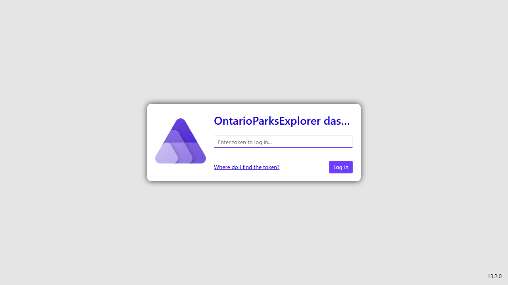
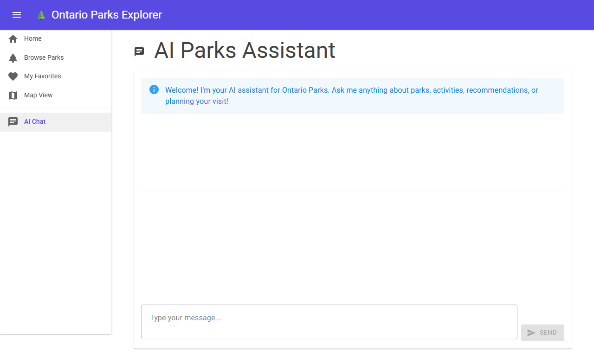
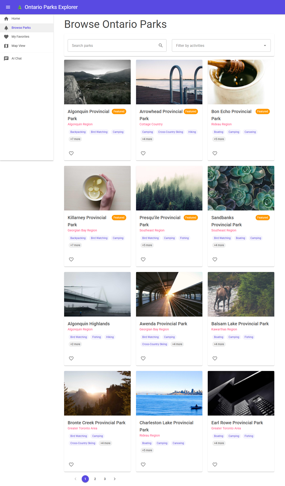

# From Prompt to Production

**How an AI team built a full-stack .NET Aspire app from a PRD — and what the human had to fix**

---

## 1. The PRD

It started with a structured product requirement document, not a one-liner.

Bruno Capuano gave GitHub Copilot CLI and Squad a complete specification — stack requirements, core features, AI integration, and one critical instruction:

> *"See the PRD below and create a team and a plan to complete this. Do not implement anything, just create the team and the plan."*

Here's the full original prompt from `docs/ontario_parks_explorer_prompt.md`:

```
# Ontario Parks Explorer (with Copilot SDK)

## Title
Build an Ontario Parks Explorer app using .NET 10, Aspire, Blazor, React, and GitHub Copilot SDK

## Prompt
Create a modern full-stack application named OntarioParksExplorer.

The goal is to build a developer-friendly, demo-ready app that allows users to explore 
parks in Ontario (Canada), view details about each park, and interact with the data in 
a visual and intuitive way.

## Stack Requirements
- .NET 10
- ASP.NET Core backend
- Entity Framework Core with SQLite
- .NET Aspire for orchestration
- Blazor frontend
- React frontend (TypeScript preferred)
- GitHub Copilot SDK for AI-related features  ← THIS IS KEY
- Latest stable libraries

Both frontends must consume the same backend APIs and share the same data.

## Core Features
- Browse parks
- Search parks
- Filter by activities
- View park details
- Map visualization
- Favorites

## AI-Ready Features (Copilot SDK)
- Park summaries
- Recommendations
- Q&A (e.g. best parks for hiking)
- "Plan my visit"
```

Notice what's specified in the original PRD: **"GitHub Copilot SDK for AI-related features"** — not OpenAI, not Azure OpenAI. Copilot SDK. This detail will matter later.

The meta-instruction was equally important: *create a team and a plan FIRST. Do not implement anything.* This is planning-driven development, not cowboy coding.

---

## 2. Assembling the Team

Commit `2a60baf`: *"docs(squad): Initialize team for OntarioParksExplorer"*

[Squad](https://github.com/bradygaster/squad) doesn't generate code by committee. It creates *specialized agents* — each with a defined role, bounded expertise, and persistent memory. For this project, it assembled a team from the Jurassic Park universe:

| Agent | Role | Specialty |
|-------|------|-----------|
| 🏗️ **Malcolm** | Lead / Architect | Architecture decisions, Aspire orchestration, code review |
| 🔧 **Arnold** | Backend Dev | ASP.NET Core APIs, EF Core, SQLite, services layer, DTOs |
| ⚛️ **Sattler** | Frontend Dev | Blazor (MudBlazor), React (TypeScript/Vite), Leaflet maps, UX |
| 🤖 **Grant** | AI Dev | AI integration, prompt engineering, provider implementation |
| 🧪 **Muldoon** | Tester | 46+ unit tests, Playwright E2E specs, screenshot automation |
| ⚙️ **Hammond** | Aspire Expert | .NET Aspire orchestration, service startup ordering, health checks |
| 📋 **Scribe** | Session Logger | Decision tracking, cross-agent context, history management |
| 🔄 **Ralph** | Work Monitor | Work queue tracking, backlog monitoring |

Each agent has:
- A **charter** that defines what they can and cannot touch
- **Persistent memory** — they remember past decisions and can reference them
- Access to **shared decisions** — a living document that records architectural choices

The agents don't just generate code in isolation. They coordinate. When Arnold designs a DTO, Sattler knows the shape of the data her components will consume. When Hammond configures Aspire orchestration, Malcolm reviews the service topology.

The team structure was committed *before* any implementation code. Planning before coding.

---

## 3. First Build — The Foundation

Commit `262d55a`: *"feat: Complete OntarioParksExplorer implementation"*

The first build delivered a working application. Not a scaffold. Not a skeleton. A running system with data, UI, and orchestration.

Here's what the team built in parallel:

**Arnold** (Backend) created the API from scratch:
- Three-layer architecture: Controllers → Services → DbContext
- Entity Framework Core with SQLite (`parks.db`)
- Many-to-many relationship: Parks ↔ Activities via explicit join table
- 67 Ontario Provincial Parks seeded from `seed-data/parks.json`
- Paginated endpoints (page 1, 12 items, max 100) with `PagedResultDto<T>`
- Search by name/description, filter by activities with "any" and "all" modes
- Swagger/OpenAPI — enabled in Development only

**Sattler** (Frontend) built two complete UIs:
- **Blazor** — Interactive Server mode with MudBlazor components, Leaflet map via JS interop, localStorage favorites, 300ms debounced search
- **React** — TypeScript + Vite + React Router, custom CSS (no component library), responsive mobile-first layout

**Hammond** (Aspire) orchestrated the whole thing:
- AppHost registering three services: API, Blazor, React (via `AddNpmApp`)
- Service discovery with `http://api` base address convention
- Startup ordering: `.WaitFor(api)` on Blazor to ensure the API is healthy before the frontend starts
- Health checks, telemetry, and OpenTelemetry pipeline to the Aspire Dashboard

**Grant** (AI) wired the initial AI endpoints:
- Four endpoints under `/api/ai`: park summaries, recommendations, chat, visit planner
- **Used OpenAI integration** via `Microsoft.Extensions.AI` abstractions
- Graceful degradation — AI endpoints return friendly messages when unconfigured, never throw

**Here's the problem:** Grant used OpenAI. The PRD specified **GitHub Copilot SDK**. The abstraction layers (`IAiService`, `Microsoft.Extensions.AI`) were good architecture, but the wrong provider was plugged in.

The team had drifted from the spec. Nobody noticed yet.


The architecture:

```
┌─────────────────────────────────────────────────────────────────┐
│                    ONTARIO PARKS EXPLORER                       │
├─────────────────────────────────────────────────────────────────┤
│                                                                 │
│  ┌──────────────────┐           ┌──────────────────┐           │
│  │   Blazor UI      │           │   React UI       │           │
│  │  (MudBlazor)     │           │  (TypeScript)    │           │
│  └────────┬─────────┘           └────────┬─────────┘           │
│           └──────────────┬───────────────┘                     │
│                    ┌─────▼─────────┐                           │
│                    │ ASP.NET Core  │                           │
│                    │   REST API    │                           │
│                    └─────┬────────┘                            │
│              ┌───────────┼──────────┐                          │
│        ┌─────▼──────┐ ┌──▼───────┐ ┌▼────────────┐            │
│        │  SQLite    │ │ GitHub  │ │ Health      │            │
│        │  (EF Core) │ │ Copilot │ │ Checks &   │            │
│        │            │ │ SDK     │ │ Metrics     │            │
│        └────────────┘ └─────────┘ └─────────────┘            │
│                                                                │
│                .NET Aspire Orchestration                       │
└─────────────────────────────────────────────────────────────────┘
```


*The Aspire Dashboard after `aspire run` — three healthy services, all discovered automatically.*

At this point, the app ran. You could browse parks, search, filter, view them on a map, and ask AI questions (if you had an OpenAI key configured). The foundation was solid.

But it wasn't the foundation the PRD asked for.

---

## 4. The Human Catches the Drift

This is the chapter that matters.

Bruno reviewed the deliverable against the original PRD. The AI team had built a beautiful full-stack application with dual frontends, clean architecture, complete tests, and working AI features. But they had drifted from the spec on a key requirement.

**The PRD said:** GitHub Copilot SDK for AI features.  
**The team built:** OpenAI integration.

AI teams, like human teams, can drift from requirements when they default to what they "know" instead of what they were asked to build. The human caught it.

Bruno's correction prompt (verbatim):

> *"The AI chat feature should not use OpenAI APIs, it should use Microsoft Agent Framework and Copilot SDK Agents, so we can reuse the current Copilot installation. Also in the Blazor web app, the map is not showing — do we need a key or similar? Add a configuration or settings page if they are needed to set these keys or values. Process all of this and complete the work. Once completed, take screenshots and create a user manual. Push everything to the repo once it's done."*

One paragraph. Five tasks. The human was now acting as product manager **and** QA.

**Grant** (AI Dev) took the lead on the course correction:
- Removed `OpenAI` and `Microsoft.Extensions.AI.OpenAI` NuGet packages
- Added `Microsoft.Extensions.AI.CopilotSDK` (GitHub Copilot SDK)
- Replaced the `IChatClient` registration to use Copilot's token-based auth
- Updated `AiService` to work with the new provider — **same interface, different backend**
- No API key configuration needed anymore — Copilot SDK authenticates through the existing Copilot installation

**Here's the critical insight:** Because Arnold had originally built the AI service behind an `IAiService` abstraction, and Grant had used `Microsoft.Extensions.AI` as the provider-agnostic layer, the swap was surgical. The controllers didn't change. The frontend didn't change. The tests barely changed.

The abstraction layers **accidentally saved the team** — they were built for testability and clean architecture, but they paid off when the requirement correction came in. Good architecture has this property: it makes pivots cheap.

But the prompt asked for more than an AI swap.

**Sattler** (Frontend) fixed the Blazor map:
- The map wasn't rendering — a timing bug. Leaflet was being initialized before the Blazor component had finished its interactive render
- Fix: adjusted the JS interop timing in `Map.razor` to ensure the DOM element existed before Leaflet attached to it
- No API key was needed (Leaflet + OpenStreetMap tiles are free)

**Arnold** (Backend) added a Settings page:
- New `/api/settings` endpoint reporting AI and map configuration status
- Sattler built the UI for it in both Blazor and React
- Lets users verify their setup without digging through config files

**Muldoon** (Tester) verified everything:
- 46 unit tests passing — AI service tests updated for the new provider
- E2E Playwright specs covering the full user journey
- Automated screenshot capture for documentation

All of this landed across commits `6040ecb`, `374025a`, and `56f54de`: *"Replace OpenAI with Microsoft Agent Framework + GitHub Copilot SDK"*.


*The AI chat interface — now powered by GitHub Copilot SDK as originally specified.*

> 💡 **Key Takeaway:** AI teams can build from specs. But they can also drift from specs. The human's job isn't to write code — it's to enforce the spec and catch deviations. The original PRD was right. The AI got it wrong. The human fixed it. That's the workflow.

---

## 5. Polish & Documentation

After the course correction landed, the remaining prompts were about refinement and making the repo public-ready.

**Commit `6040ecb`:** Bruno caught wrong Aspire CLI install commands in the docs. Fixed to use the official install script: `irm https://aspire.dev/install.ps1 | iex`.

**Commit `374025a`:** The docs said `dotnet run --project AppHost`. Bruno corrected it: `aspire run` is the canonical command, and it outputs the dashboard URL with an auth token.

**Commit `332c165`:** Sattler reorganized all documentation into `docs/` folder with screenshot-rich user manual.

**Commit `4b1d64d`:** Malcolm rewrote the README from a standard project readme into a showcase document. The original prompt was embedded. The team roster was displayed. Architecture diagram, screenshots, and getting-started instructions — all reframed as "here's what AI agents built."

**Muldoon's screenshot automation** deserves a callout. Instead of manually capturing screenshots, Playwright E2E tests were configured to:
1. Start the Aspire-orchestrated app
2. Navigate through every major page (Home, Parks, Map, Chat, Settings, Swagger)
3. Capture standardized 1280×800 screenshots
4. Save them to `screenshots/` with numbered filenames

Twelve screenshots. Zero manual effort. Repeatable on every build.


*Automated screenshot: the Parks page with search bar and activity filter chips.*

---

## 6. The Decisions Trail

AI agents don't just generate code — they make *decisions*. And those decisions are recorded in `decisions.md`, a shared document that any agent can reference and any human can audit.

Here are four entries that enabled the course correction:

### Decision: Three-Layer Architecture
> **Arnold, 2026-03-28** — Controllers (HTTP concerns) → Services (business logic) → DbContext (data access). Ensures clean separation of concerns, testability, and easy integration of cross-cutting concerns like caching.

*Why this enabled the correction:* This is the decision that made the OpenAI-to-Copilot pivot painless. Because the AI logic lived in a service layer behind an interface, swapping the provider didn't ripple through controllers or tests. The abstraction layers ACCIDENTALLY saved the team when the spec correction came.

### Decision: Idempotent Database Seeding
> **Arnold, 2026-03-28** — Automatic seeding in Program.cs with idempotency check: `if (!await context.Parks.AnyAsync())`. Ensures database always seeded on first run without duplicate data on restart.

*Why this matters:* "Clone and run" is the developer experience goal. No manual migration commands. No seed scripts to remember. The app works on first launch. This is what makes it demo-ready.

### Decision: Graceful AI Degradation
> **Grant, 2026-03-28** — All AI methods check `_isConfigured` flag and return friendly messages when unconfigured. Try/catch with logging, never throw to caller.

*Why this matters:* The app works without AI configured. You can browse parks, use the map, save favorites — all without a Copilot SDK setup. AI is additive, not required. This decision meant the OpenAI→Copilot swap didn't break the core app.

### Decision: Aspire Startup Ordering
> **Hammond, 2026-03-28** — Added `.WaitFor(api)` to Blazor resource ensuring API starts first. Service discovery via `http://api` base address.

*Why this matters:* Without this, the Blazor frontend might start before the API is healthy, causing failed requests on initial page load. One line of orchestration config prevents a class of race conditions.

---

## 7. What's in the Box

The final repository contains:

| Component | Details |
|-----------|---------|
| **API** | ASP.NET Core REST API, 5 park endpoints + 4 AI endpoints, EF Core + SQLite |
| **Blazor Frontend** | MudBlazor UI, Interactive Server, Leaflet maps, favorites, AI chat |
| **React Frontend** | TypeScript + Vite, React Router, custom CSS, responsive design |
| **Aspire Orchestration** | AppHost with service discovery, health checks, telemetry dashboard |
| **Database** | SQLite with 67 Ontario parks, 20+ activities, many-to-many relationships |
| **Tests** | 46+ unit tests (xUnit), Playwright E2E specs with screenshot automation |
| **Documentation** | User Manual, Demo Script, this Journey doc, team decisions log |

### How to run it

```bash
git clone https://github.com/elbruno/CanadaParksTour.git
cd CanadaParksTour/OntarioParksExplorer

# Install React dependencies
cd OntarioParksExplorer.React && npm install && cd ..

# Start everything
aspire run
```

The Aspire Dashboard URL (with auth token) appears in the terminal output. From there, you can reach:

| Service | What you'll see |
|---------|----------------|
| **Aspire Dashboard** | Three healthy services, logs, metrics |
| **Blazor Frontend** | Full park explorer with map, search, AI chat |
| **React Frontend** | Same features, different UI framework |
| **API + Swagger** | Interactive API documentation |

### The commit timeline

| Commit | What happened |
|--------|---------------|
| `2a60baf` | Squad initialized — 8 agents assembled, charters defined |
| `262d55a` | **Complete implementation** — API, Blazor, React, AI (OpenAI), 67 parks seeded |
| `98676b6` | Screenshots captured via Playwright automation |
| `6040ecb` | Aspire CLI install command fixed (community feedback) |
| `374025a` | `aspire run` documented as canonical launch command |
| `56f54de` | **The course correction** — OpenAI replaced with Copilot SDK per original spec |
| `332c165` | Docs reorganized into `docs/` folder |
| `4b1d64d` | README rewritten as Copilot CLI + Squad showcase |
| `f95db0a` | Scribe merged decision inbox, updated agent histories |
| `18c3222` | Journey doc (v1) — narrative of the build |
| `2c8da97` | Scribe session log update |

---

## The Takeaway

This project started as an experiment: *can a team of AI agents, coordinated by Squad and powered by GitHub Copilot CLI, build a real application from natural language?*

The answer is yes — with caveats.

**What worked well:**
- **Parallel specialization** — agents working simultaneously on backend, frontend, orchestration, and testing
- **Persistent memory** — agents didn't lose context between sessions; they remembered past decisions and built on them
- **Abstraction discipline** — the three-layer architecture and provider-agnostic AI abstractions made the mid-project correction possible
- **Decision documentation** — every architectural choice was recorded, creating an audit trail that most human teams don't maintain

**What required human intervention:**
- **Spec enforcement** — the PRD said Copilot SDK. The AI defaulted to OpenAI. The human caught it.
- **Correctness checks** — Aspire CLI install command, map rendering bug, docs organization
- **Quality bar** — "take screenshots and create a user manual" was a human requirement

**The honest summary:**

AI teams can build from specs. But they can also drift from specs — just like human teams. The difference is that the human catches it faster because the AI commits decisions to a shared log.

The abstraction layers were built for testability and clean architecture. They accidentally saved the team when the spec correction came in. Good architecture has this property: it makes pivots cheap.

The original PRD was right. The AI got it wrong. The human enforced the spec. That's the workflow.

**The prompt is the product specification. The human is the product manager. And sometimes the QA team too.**

Nine commits. Eight agents. One terminal. One person driving.

That's the journey.

---

*Written by Malcolm (Lead/Architect) as part of the Squad documentation effort. Sources: git history, decisions.md, agent memory files, original PRD. No facts hallucinated — though Malcolm would note that "life finds a way" applies to software projects, especially when you're debugging JavaScript timing bugs in Blazor components at 2 AM.*
